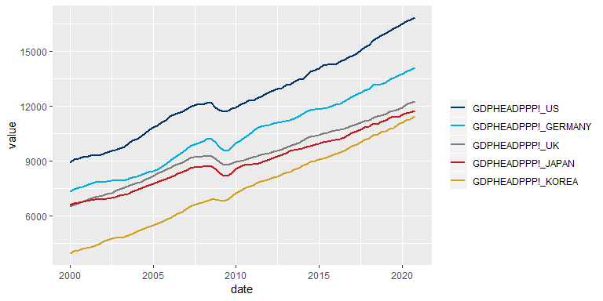
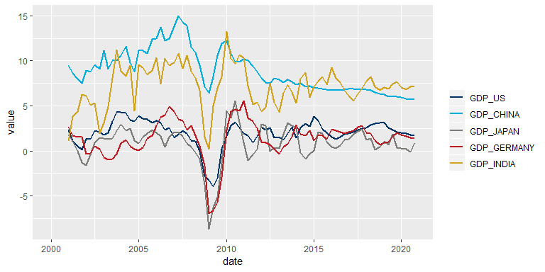

oemdlRtools
================

-   [Installation](#installation)
-   [Loading the package](#loading-the-package)
-   [How to use oemdlRtools](#how-to-use-oemdlrtools)
    -   [Import data](#import-data)
    -   [Plot the data](#plot-the-data)
    -   [Import GDP data for all available locations](#import-gdp-data-for-all-available-locations)
    -   [Import GDP data for a set of locations specified by ISO 3-character code](#import-gdp-data-for-a-set-of-locations-specified-by-iso-3-character-code)
    -   [Convert data to growth rates and differences](#convert-data-to-growth-rates-and-differences)

`oemdlRtools` is an R package to import data from an [Oxford Economics](http://oxfordeconomics.com/) [Global Economic Model](https://www.oxfordeconomics.com/global-economic-model) database file (`.db`) into an R data frame. It relies on the [Oxford Economics Mdl tool](http://tools.oxfordeconomics.com/mdl/downloads.aspx) to generate a `.csv` file, which is then imported into R and transformed into a format suitable for data analysis.

Note that the package is still considered work-in-progress and comes no warranty. Comments, suggestions or patches are welcome!

Installation
============

Install the R package by running these commands.

``` r
library("devtools")
install_github("stefanangrick/oemdlRtools")
```

Note that the package requires a working installation of the [Oxford Economics Global Economic Model](https://www.oxfordeconomics.com/my-oxford/global-economic-model) and the [Oxford Economics Mdl tool](http://tools.oxfordeconomics.com/mdl/downloads.aspx). The [Mdl tool](http://tools.oxfordeconomics.com/mdl/readme.html) needs to be present in your system's %PATH% variable. Run `cmd.exe` and type `echo %PATH%` to confirm that this is the case.

Loading the package
===================

``` r
library("oemdlRtools")
```

How to use oemdlRtools
======================

Import data
-----------

To import data for a given set of indicators, run the below commands. Note that you will need to set your working directory to the folder containing the database file, e.g. `setwd("C:/OEF")`. The folder needs to be writeable. If `read_oedb` is called without specifying any indicators, all variables from the databata (`.db`) file will be imported.

``` r
ids <- c("GDPHEADPPP!,US", "GDPHEADPPP!,GERMANY", "GDPHEADPPP!,UK",
         "GDPHEADPPP!,JAPAN", "GDPHEADPPP!,KOREA")
dat <- read_oedb("Jan19.db", "C:/OEF", 2000, 2020, ids, "V")$df
head(dat)
```

    ##         date GDPHEADPPP!_US GDPHEADPPP!_GERMANY GDPHEADPPP!_UK
    ## 1 2000-01-01       8898.817            7352.205       6541.710
    ## 2 2000-04-01       9090.515            7455.898       6628.956
    ## 3 2000-07-01       9130.460            7542.212       6710.438
    ## 4 2000-10-01       9213.882            7610.816       6786.868
    ## 5 2001-01-01       9221.404            7694.218       6867.373
    ## 6 2001-04-01       9307.969            7783.763       6949.608
    ##   GDPHEADPPP!_JAPAN GDPHEADPPP!_KOREA
    ## 1          6595.489          3958.563
    ## 2          6686.146          4067.114
    ## 3          6745.810          4146.842
    ## 4          6774.784          4198.056
    ## 5          6808.227          4238.933
    ## 6          6854.067          4291.660

Plot the data
-------------

The package contains a function `oe_pal()` to return the Oxford Economics colour palette. This can be used in conjunction with plotting tools, such as [ggplot2](https://ggplot2.tidyverse.org/).

``` r
library("ggplot2")
library("reshape2")

plt <- ggplot(data = melt(dat, id = "date"), mapping = aes(x = date, y = value, color = variable)) +
  geom_line(size = 1) +
  scale_color_manual("", values = oe_pal()[1:5])
plt
```



ggplot2 objects can be further converted to interactive [plotly](http://plot.ly/) graphs.

``` r
library("plotly")
ggplotly(plt)
```

Import GDP data for all available locations
-------------------------------------------

The package contains a function `oe_macromappings()` which returns a data frame containing all Oxford Economics location names and corresponding [ISO 3-character codes](https://en.wikipedia.org/wiki/ISO_3166-1_alpha-3).

``` r
ids <- paste0("GDP,", unique(oe_macromappings()$oesector))
dat <- read_oedb("Jan19.db", "C:/OEF", 2000, 2020, ids, "V")$df
```

Import GDP data for a set of locations specified by ISO 3-character code
------------------------------------------------------------------------

The function `oe_macromappings()` can be used to convert [ISO 3-character codes](https://en.wikipedia.org/wiki/ISO_3166-1_alpha-3) to Oxford Economics location names (and back). ISO 3-character codes can be further converted to other formats using the [countrycodes package](https://cran.r-project.org/web/packages/countrycode/index.html), e.g. [ISO 2-character codes](https://en.wikipedia.org/wiki/ISO_3166-1_alpha-2).

``` r
ctr <- oe_macromappings()$oesector[match(c("USA", "CHN", "JPN", "DEU", "IND"), oe_macromappings()$iso3c)]
ids <- paste0("GDP,", ctr)
dat <- read_oedb("Jan19.db", "C:/OEF", 2000, 2020, ids, "V")$df
```

Convert data to growth rates and differences
--------------------------------------------

The package contains a set of convenience functions to calculate growth rates and differences for data series of different frequencies. Available functions are:

-   `diffp(x)` for period-on-period differences.
-   `pch(x)` for period-on-period growth rates (percent).
-   `pach(x)` for quarter-on-quarter annualised growth rates (percent).
-   `diffy(x)` for year-on-year differences.
-   `pchy(x)` for year-on-year growth rates (percent).

``` r
dat[, -1] <- sapply(dat[, -1], pchy)
plt <- ggplot(data = melt(dat, id = "date"), mapping = aes(x = date, y = value, color = variable)) +
  geom_line(size = 1) +
  scale_color_manual("", values = oe_pal()[1:5])
plt
```


