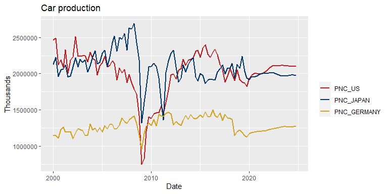

oemdlRtools
================

`oemdlRtools` is an R package to import data from an [Oxford
Economics](http://oxfordeconomics.com/) [Global Economic
Model](https://www.oxfordeconomics.com/global-economic-model) database
file (`.db`) into an R data frame. It relies on the [Oxford Economics
Mdl tool](https://tools.oxfordeconomics.com/mdl/downloads.aspx) to
generate a temporary `.csv` file, which is then imported into R and
transformed into a format suitable for data analysis.

# Setup

Note that the package requires a working installation of the [Oxford
Economics Global Model
Workstation](https://www.oxfordeconomics.com/my-oxford/global-economic-model)
and the [Oxford Economics Mdl
tool](https://tools.oxfordeconomics.com/mdl/downloads.aspx). Mdl needs
to be present in the system’s user path variable, which is the case if
Mdl has been installed using the [.msi installer
package](https://tools.oxfordeconomics.com/mdl/downloads.aspx). Users
may run `cmd.exe` and type `echo %PATH%` to confirm that Mdl is present
in the user path variable.

Once Mdl has been installed, install the R package by running these
commands:

``` r
library("devtools")
install_github("stefanangrick/oemdlRtools")
```

Then load the package:

``` r
library("oemdlRtools")
```

# Import data

Set your working directory to the folder containing the database file
you’d like to import data from via `setwd("C:/OEF")`. Then use the
`read_oedb()` function to import data from a database (`.db`) file.

To import real GDP and consumption data for all available countries, use
the `mnemonic` parameter:

``` r
ex01 <- read_oedb(db = "Jan20_1.db", mnemonic = c("GDP", "C"),
                  start_year = 2000, end_year = 2024)
head(ex01$dat[, 1:7])
```

    ##         date   GDP_US     C_US GDP_JAPAN  C_JAPAN GDP_GERMANY C_GERMANY
    ## 1 2000-01-01 3231.050 2130.175  114918.9 65624.33      634.08    359.55
    ## 2 2000-04-01 3290.200 2150.750  115242.1 65441.10      639.38    363.52
    ## 3 2000-07-01 3294.600 2171.875  115327.2 65552.73      639.15    362.79
    ## 4 2000-10-01 3315.125 2190.550  116462.8 66390.83      637.10    359.75
    ## 5 2001-01-01 3305.675 2199.325  117081.7 66629.38      649.97    366.68
    ## 6 2001-04-01 3325.000 2204.525  116516.3 67257.00      649.74    365.92

To import all available data for Japan and Germany, use the `sector`
parameter:

``` r
ex02 <- read_oedb(db = "Jan20_1.db", sector = c("JAPAN", "GERMANY"),
                  start_year = 2000, end_year = 2024)
head(ex02$dat[, c(1:4, 744:746)])
```

    ##         date GDP_JAPAN IP_JAPAN  C_JAPAN GDP_GERMANY IP_GERMANY C_GERMANY
    ## 1 2000-01-01  114918.9 104.8000 65624.33      634.08   81.80000    359.55
    ## 2 2000-04-01  115242.1 107.5667 65441.10      639.38   83.63333    363.52
    ## 3 2000-07-01  115327.2 108.1667 65552.73      639.15   84.83334    362.79
    ## 4 2000-10-01  116462.8 109.6333 66390.83      637.10   85.03333    359.75
    ## 5 2001-01-01  117081.7 106.2000 66629.38      649.97   85.30000    366.68
    ## 6 2001-04-01  116516.3 102.5000 67257.00      649.74   84.03333    365.92

To import real GDP and consumption data for Japan and Germany only,
combine the `mnemonic` and `sector` parameters:

``` r
ex03 <- read_oedb(db = "Jan20_1.db", mnemonic = c("GDP", "C"),
                  sector = c("JAPAN", "GERMANY"),
                  start_year = 2000, end_year = 2024)
head(ex03$dat)
```

    ##         date GDP_JAPAN  C_JAPAN GDP_GERMANY C_GERMANY
    ## 1 2000-01-01  114918.9 65624.33      634.08    359.55
    ## 2 2000-04-01  115242.1 65441.10      639.38    363.52
    ## 3 2000-07-01  115327.2 65552.73      639.15    362.79
    ## 4 2000-10-01  116462.8 66390.83      637.10    359.75
    ## 5 2001-01-01  117081.7 66629.38      649.97    366.68
    ## 6 2001-04-01  116516.3 67257.00      649.74    365.92

For more fine-grained control, use `mnemonic_sector` to specify custom
mnemonic-sector combinations. To import US nominal GDP, Japan’s current
account relative to GDP, and South Korea’s trade balance in dollar
terms, create the following data frame:

``` r
mn_sec <- data.frame("Mnemonic" = c("GDP!", "BCU%", "BVI$"),
                     "Sector" = c("US", "JAPAN", "KOREA"),
                     stringsAsFactors = FALSE)
mn_sec
```

    ##   Mnemonic Sector
    ## 1     GDP!     US
    ## 2     BCU%  JAPAN
    ## 3     BVI$  KOREA

Now run:

``` r
ex04 <- read_oedb(db = "Jan20_1.db", mnemonic_sector = mn_sec,
                  start_year = 2000, end_year = 2024)
head(ex04$dat)
```

    ##         date GDPexc_US BCUpct_JAPAN BVIusd_KOREA
    ## 1 2000-01-01  2500.725     2.646024       3553.2
    ## 2 2000-04-01  2561.925     2.859763       3395.9
    ## 3 2000-07-01  2579.950     2.846237       5397.3
    ## 4 2000-10-01  2609.750     2.319407       3046.0
    ## 5 2001-01-01  2618.225     2.177327       3099.9
    ## 6 2001-04-01  2649.450     1.672319       2975.1

Note that in addition to the actual data (`$dat`), the function returns
fix metadata (`$fix`) and general variable information (`$var`). By
default mnemonics are transformed into syntactically valid R names using
simple replacement rules. To revert the transformation, you may use the
hidden function `.revert_names()`.

# Import data from an industry model database

To import data from an Oxford Economics [Global Industry
Model](https://www.oxfordeconomics.com/my-oxford/global-industry-model)
database, simply set the `model_dir` parameter to your industry model
directory:

``` r
exind <- read_oedb(db = "Feb1i.db", mnemonic = c("PNC", "PNR"),
                   model_dir = "C:/OxfordGlobalIndustry",
                   start_year = 2000, end_year = 2024)
head(exind$dat[, 1:7])
```

    ##         date  PNC_US PNC_CHINA PNC_JAPAN PNC_FRANCE PNC_GERMANY PNC_ITALY
    ## 1 2000-01-01 2465271    123088   2126886     742004     1145384    376574
    ## 2 2000-04-01 2491391    148315   2222944     679510     1147012    326648
    ## 3 2000-07-01 2123059    178945   1961918     696881     1109948    317793
    ## 4 2000-10-01 2192453    154329   2051296     759836     1229619    389498
    ## 5 2001-01-01 2084534    164882   2068927     721953     1262234    366591
    ## 6 2001-04-01 2327315    194943   2118191     750334     1194913    300124

# Specify locations by ISO code

The package contains a function `oe_macromappings()` which can be used
to convert [ISO 3-character
codes](https://en.wikipedia.org/wiki/ISO_3166-1_alpha-3) to Oxford
Economic sector names and back. To get the Oxford Economics sector names
for the United States, China and Australia, run:

``` r
oe_macromappings()$oesector[match(c("USA", "CHN", "AUS"), oe_macromappings()$iso3c)]
```

    ## [1] "US"       "CHINA"    "AUSTRALI"

ISO 3-character codes can be further converted to other formats,
e.g. [ISO 2-character
codes](https://en.wikipedia.org/wiki/ISO_3166-1_alpha-2), using the
[countrycodes
package](https://cran.r-project.org/web/packages/countrycode/index.html).

# Plot the data

To plot the data using the [ggplot2](https://ggplot2.tidyverse.org/)
package:

``` r
library("ggplot2")
library("reshape2")

plt <- ggplot(data = melt(
  exind$dat[, c("date", "PNC_US", "PNC_JAPAN", "PNC_GERMANY")], id = "date"),
  mapping = aes(x = date, y = value, color = variable)) +
  geom_line(size = 1) +
  scale_color_manual("", values = oe_palette()) +
  labs(title = "Car production", x = "Date", y = "Thousands")
plt
```



ggplot2 objects can be converted further to interactive
[plotly](http://plot.ly/) graphs:

``` r
library("plotly")
ggplotly(plt)
```
